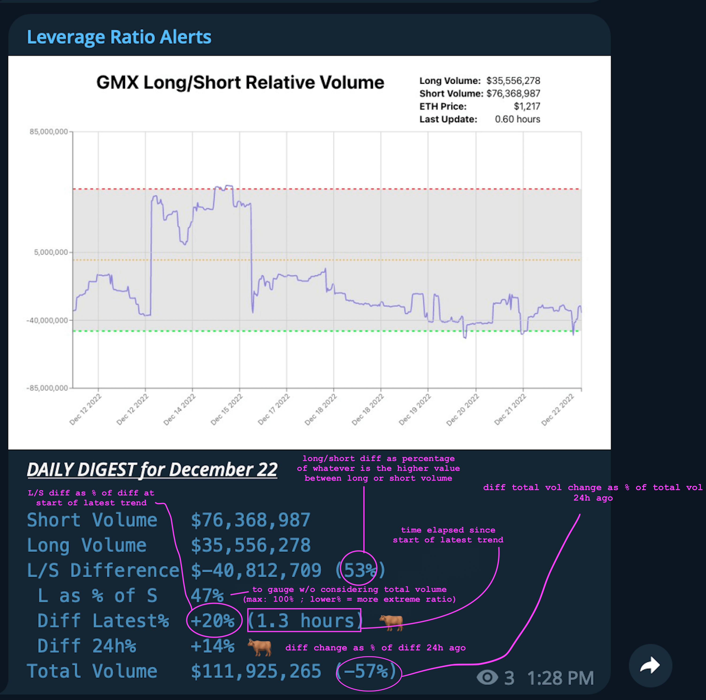

## Running Locally

Make sure you have [Node.js](http://nodejs.org/) and the [Heroku CLI](https://cli.heroku.com/) installed.

in root directory
```sh
$ node index.js
```

in /client
```sh
$ npm start
```

Your app should now be running on [localhost:3000](http://localhost:3000/).

## Deploying to Production

```
...
```

## Telegram Message Legend

